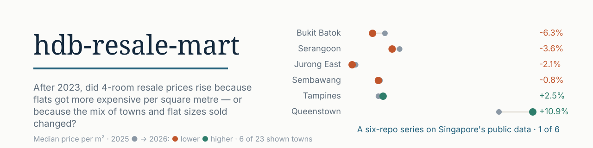
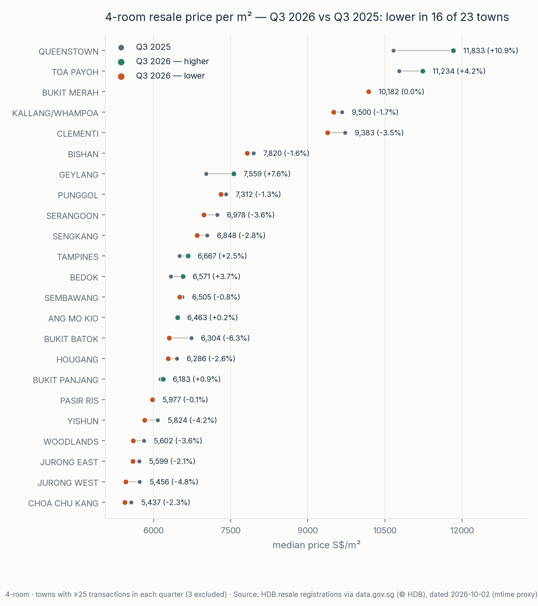
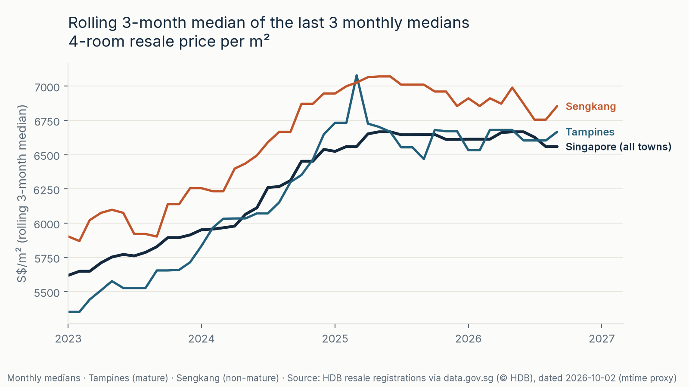
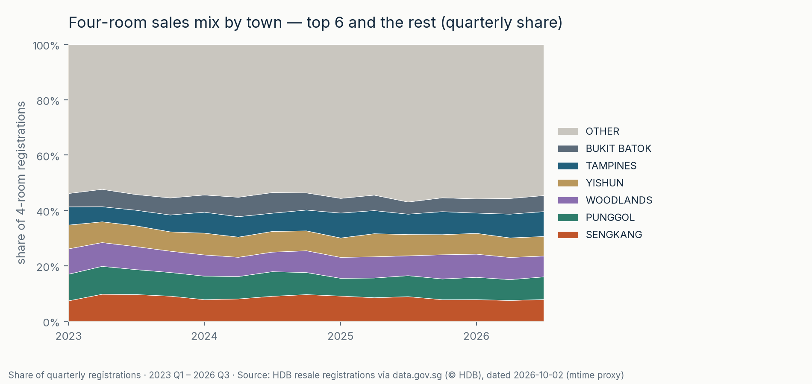
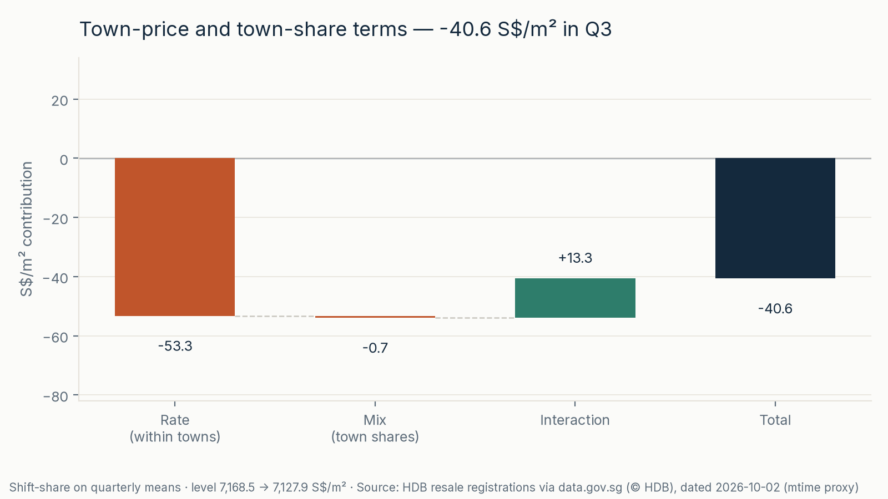
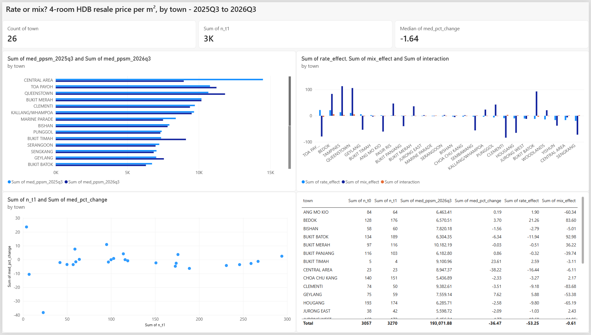

<picture>
  <source media="(prefers-color-scheme: dark)" srcset="assets/banner-dark.svg">
  <source media="(prefers-color-scheme: light)" srcset="assets/banner.svg">
  
</picture>

# hdb-resale-mart

[](https://github.com/faizsaifulnizam/hdb-resale-mart/actions/workflows/ci.yml) [](LICENSE)   [](https://data.gov.sg/datasets/d_8b84c4ee58e3cfc0ece0d773c8ca6abc/view) [](bi/README.md)

> **Answer:** 4-room resale price per m² dipped in Q3 2026 vs a year earlier: **−1.3%** on the headline median (S$6,647 → **S$6,559/m²**) and **−0.6%** on the mean basis used for the decomposition — both point the same way (the split needs means because medians are not additive). Town-share mix nets to ≈0: rate **−53.3 S$/m²**, mix **−0.7**, interaction **+13.3**. “Rate” still includes what sold within each town: **Central Area (23 sales in each quarter) contributes −16.4 of that −53.3**, coinciding with fewer Cantonment Road Type S1 sales (15 → 8). Restricting the split to towns with ≥25 sales in each quarter moves the rate to **−38.5**. A small dip; not a like-for-like flat-price estimate; one quarter.

**Status:** built 2026-10-02. Part of a six-repo series on Singapore's public data.

**Intended use:** For a housing-market analyst, this brief puts the headline move in context before drawing local conclusions, so read the sales composition and time-window sensitivity alongside it. It is not a buy or sell recommendation, and a national or town average is not a like-for-like flat-price change.

## Key numbers (all reproducible)

- **Headline:** national 4-room median price/m² 6,647 → 6,559 (**−1.32%**, medians) · **−0.57%** on the mean basis that the split uses; Q3 2026 vs Q3 2025.
- **16 of 23** shown towns lower; range **Queenstown +10.9% → Bukit Batok −6.3%** (towns need ≥25 sales in each compared quarter to appear in headline charts; all 26 are in the CSV).
- **Shift-share** (transaction-weighted, means): total −40.6 S$/m² = rate **−53.3** + mix **−0.7** + interaction **+13.3** (the overlap term — town-weight shifts coinciding with town-price moves; reported, not folded in).
- **Small across windows** (totals −0.6% … +1.0%; **the sign is not stable**): [`docs/sensitivity.md`](docs/sensitivity.md).

<picture>
  <source media="(prefers-color-scheme: dark)" srcset="reports/figures/f1_town_dumbbell-dark.png">
  <source media="(prefers-color-scheme: light)" srcset="reports/figures/f1_town_dumbbell.png">
  
</picture>

### More views

| | |
|---|---|
| <a href="reports/figures/f2_rolling_median.png"><picture><source media="(prefers-color-scheme: dark)" srcset="reports/figures/f2_rolling_median-dark.png"><source media="(prefers-color-scheme: light)" srcset="reports/figures/f2_rolling_median.png"></picture></a> | <a href="reports/figures/f3_mix_drift.png"><picture><source media="(prefers-color-scheme: dark)" srcset="reports/figures/f3_mix_drift-dark.png"><source media="(prefers-color-scheme: light)" srcset="reports/figures/f3_mix_drift.png"></picture></a> |
| <a href="reports/figures/f4_waterfall.png"><picture><source media="(prefers-color-scheme: dark)" srcset="reports/figures/f4_waterfall-dark.png"><source media="(prefers-color-scheme: light)" srcset="reports/figures/f4_waterfall.png"></picture></a> | <a href="reports/figures/bi_page.png"><picture><source media="(prefers-color-scheme: dark)" srcset="reports/figures/bi_page-dark.png"><source media="(prefers-color-scheme: light)" srcset="reports/figures/bi_page.png"></picture></a> |

*Rolling medians (`f2`), town-mix drift (`f3`), the rate/mix waterfall (`f4`), and the historical Power BI export (`bi_page`) — full size in [`reports/figures/`](reports/figures/) · half-page write-up in [`docs/decision_memo.md`](docs/decision_memo.md). The editable BI source has corrected selection/frozen-benchmark captions; screenshots and release binary have not yet been re-exported.*

## The question

Did 4-room resale prices per m² move because town-average prices changed, or because sales shifted across towns? This repo separates those two terms using resale registrations since 2017, with a post-2023 trend view and a Q3 year-on-year headline. It holds flat type at 4-room and normalizes price by floor area; it does **not** decompose flat-size mix or reconstruct the official HDB price index.

## The data

- **HDB resale flat prices** (registration date, Jan-2017 onwards) — [data.gov.sg](https://data.gov.sg/datasets/d_8b84c4ee58e3cfc0ece0d773c8ca6abc/view), 241,822 rows × 11 columns in the historical 2026-10-02 snapshot (town, flat type, floor area, storey range, remaining lease, price). The local manifest uses file modification time as a retrieval-time proxy, not a direct download receipt.
- Licence: Singapore Open Data Licence (© Housing & Development Board). A script downloads the file into `data/raw/` (gitignored); the raw file is never edited.
- Cite note carried from HDB: prices are indicative; transactions between relatives and part-share sales are excluded.

## Method

DuckDB throughout; one row = one registered resale. The pipeline, end to end:

1. **Pull** — scripted from data.gov.sg into `data/raw/` (never edited) + a pull manifest (SHA-256, rows, month coverage): [`src/download.py`](src/download.py)
2. **Audit** — profile, then rules set *before* analysis: [`docs/data_audit.md`](docs/data_audit.md)
3. **Stage** — parse & clean; every exclusion counted: [`sql/01_staging.sql`](sql/01_staging.sql)
4. **Check** — 8 assertions (including non-empty staged data), run *before* the dataset is written; failures leave existing files untouched: [`sql/05_checks.sql`](sql/05_checks.sql) — 8/8 pass, 0 exclusions
5. **Measure** — town×type×month medians + a rolling **median of the last three monthly medians, not the median of all sales in those months** (within a three-calendar-month frame; missing months supply no median): [`sql/03_metrics.sql`](sql/03_metrics.sql)
6. **Decompose** — headline table + shift-share (rate / mix / interaction): [`sql/04_yoy.sql`](sql/04_yoy.sql) → [`outputs/town_4room_yoy.csv`](outputs/town_4room_yoy.csv)
7. **Stress** — window + threshold variants: [`docs/sensitivity.md`](docs/sensitivity.md)
8. **Draw · write · present** — figures are code, light + dark ([`src/figures.py`](src/figures.py)); then the memo ([`docs/decision_memo.md`](docs/decision_memo.md)) and the Power BI page ([`bi/`](bi/README.md))

### The comparison, made computable

The comparison is of registered 4-room transactions, not the official price index: **did town-average price per m² change (rate), or did the mix of towns sold change (mix)?** Three choices make it computable: the same-quarter window — **Q3 2026 vs Q3 2025** (quarters absorb month noise; comparing the same quarter reduces seasonal differences); a price normalized by floor area — **price per m²** (`resale_price ÷ floor_area_sqm`), 4-room flats only; and a decomposition that splits the per-m² move — **shift-share**, next. Matching the quarter does not match the individual flats.

### The decomposition (the core, in words)

Shift-share on quarterly town **means** (p), weighted by each town's share of 4-room transactions (w):

```text
total       = Σ w₁·p₁ − Σ w₀·p₀     the mean price-level move
            = Σ w₀·(p₁ − p₀)        rate        — within-town price moves
            + Σ (w₁ − w₀)·p₀        mix         — where the transactions went
            + Σ (w₁ − w₀)·(p₁ − p₀) interaction — moves × weight shifts, together
```

**Rate** answers "same towns, new prices"; **mix** answers "different towns, old prices"; **interaction** is both at once — reported on its own, not folded into either side. Scope of **rate**: it is the change in *town-average* price per m² — within a town it still includes changes in the kinds of flats sold (block, storey, lease age, model); floor area is the only attribute normalized for. This build: rate **−53.3** · mix **−0.7** · interaction **+13.3** S$/m² → town-share mix nets to ≈0 because town gains and losses offset. This does not remove within-town composition: Central Area contributes **−16.4 S$/m² (30.9% of the rate term)** with 23 sales per quarter, while Cantonment Road Type S1 sales fall from 15 to 8. That coincidence is descriptive, not causal attribution ([memo](docs/decision_memo.md) has the detail). **Why means inside the split:** medians are not additive — median(A+B) ≠ median(A) + median(B) — so that identity only holds on means; medians remain the *display* metric because they resist tails. Stated rather than hidden. The code asserts the identity (ε = 1e-9).

### Rules chosen, and why

| Rule | Choice | Why |
|------|--------|-----|
| Comparison | Q3 2026 vs Q3 2025 | same quarter reduces seasonality; not matched individual flats |
| Display threshold | ≥ 25 sales in **each** compared quarter | tiny-town medians are noise; drops 3 towns from headline charts — they stay in the CSV (display rule only) |
| Outliers | none applied | data is structurally clean; tails are real small-flat high-S$/m² cases; winsorising would hide them |
| Trend window | 2023-01 → 2026-09 | post-cooling-measures era; long enough to see the mix drift |

### Validation — receipts, not claims

- **8/8 checks** pass on the staged table, including a non-empty-data assertion; **0 exclusions** beyond the documented window/type filters — every exclusion is counted by [`src/build_dataset.py`](src/build_dataset.py).
- **Independent recompute:** 3 town-month medians + rolling medians recomputed in plain Python stdlib (no pandas/DuckDB), matched.
- **Identity assert** on the decomposition (above); **sensitivity** — totals stay small, but the sign changes: Q3 **−0.567%**, six months **−0.016%**, twelve months **+0.987%**. The threshold preserves the sign within each window, not across windows ([`docs/sensitivity.md`](docs/sensitivity.md)).
- **Rounding:** contribution columns in the CSV are display-rounded to 2 dp. At this build each component sum differs from its full-precision national value by <0.05 S$/m², but adding all three rounded component sums gives −40.55 rather than −40.62: a **0.07 S$/m² total discrepancy** (less than 0.1). The identity is checked before rounding.
- **Reproduction:** the commands below regenerate the numerical outputs from the same raw snapshot; later re-pulls can move the newest months. CSV values and image bytes are separate checks: figure bytes can differ across rendering environments even when the numbers match.
- **Safety boundaries:** shared CSV parsing rejects malformed records, duplicate headers, nonfinite numerics and stale cache receipts. Every comparison validates both national monthly calendars and finite components; unthresholded windows require full town coverage. Sparse town-months remain legal. Analysis promotes its two CSVs together; figures are read-only on CSVs and stage all eight renders plus site mirrors before promotion. Ordinary write exceptions roll back the prior generation; this is not power-loss or concurrent-reader atomicity.
- **CI:** every main-branch push and PR runs offline synthetic-fixture pipeline and regression tests (including numerical checks and figure generation), then smoke-checks committed outputs and figures — [`.github/workflows/ci.yml`](.github/workflows/ci.yml). CI does not re-download the full HDB dataset or establish a byte-identical full-source rebuild.

### Limits

**Not a forecast; not causal.** Registrations revise upward, one quarter is noisy (read it against [`docs/sensitivity.md`](docs/sensitivity.md)), and context — interest rates, BTO supply, grants — is out of scope. The full list lives under **Caveats** below.

### Principles this repo follows

1. **One question per repo** — the method serves the question, not the reverse.
2. **Audit before analysis** — rules come from the data's profile, not habit.
3. **SQL first** — the analysis lives in `sql/`; Python glues and draws.
4. **Nothing hand-edited** — raw data immutable; every number regenerates from code.
5. **Limits are part of the deliverable.**

## Reproduce

Requires [uv](https://docs.astral.sh/uv/). To reproduce the historical headline, first restore the [hash-locked licensed snapshot](data/snapshots/README.md) after cloning, then run the stages below; the downloader checks this existing cache without a network call. Use `python src/download.py --force` only for a **live refresh**, which may change historical registrations. Run this block in Bash (Linux/macOS or Git Bash on Windows):

```bash
git clone https://github.com/faizsaifulnizam/hdb-resale-mart && cd hdb-resale-mart
uv venv .venv --python 3.12          # or: python -m venv .venv
if [ -f .venv/Scripts/activate ]; then
  source .venv/Scripts/activate      # Windows Git Bash
else
  source .venv/bin/activate          # Linux / macOS
fi
uv pip install -r requirements.txt   # or: pip install -r requirements.txt

python src/download.py       # raw CSV → data/raw/ (gitignored)
python src/build_dataset.py  # staging + 8 checks → data/processed/sales.parquet
python src/analysis.py       # medians, YoY, decomposition, sensitivity → outputs/
python src/figures.py        # re-renders reports/figures/
```

Then check `outputs/town_4room_yoy.csv`: Queenstown reads 10,666.67 → 11,833.33, and the national medians match the headline above. Data as of the 2026-10-02 pull — a later re-pull can move the newest months.

## Caveats

- Registrations, not listings; the newest months can revise upward as registrations complete — the compared quarters are calendar-complete but not revision-final.
- Medians are the display metric; the decomposition uses transaction-weighted means (medians are not additive — see the memo).
- Display threshold: towns with <25 sales in a compared quarter stay in the CSV and the national decomposition but are dropped from headline charts (3 towns at this build). Central Area is one of them; its small sample materially affects the national rate term.
- Near-zero town-share mix is not evidence of like-for-like flat prices: block, storey, remaining lease and model composition can still move the town-average price/m².
- Descriptive only — no forecast, no causal claim. Context (interest rates, BTO supply, grants) is out of scope.

## Out of scope

A price predictor, block-level maps, dbt/Snowflake (a BigQuery sandbox is optional and never used as the archive).

## Licence

Code: MIT. Data: Singapore Open Data Licence — © Housing & Development Board, via data.gov.sg. This is an independent, unofficial analysis.

---

*Six-on-SG: six Singapore-data analyses plus one AI workflow — seven repos:* **[card-book-quality](https://github.com/faizsaifulnizam/card-book-quality)** · **[coe-quota-premium](https://github.com/faizsaifulnizam/coe-quota-premium)** · **[retail-sales-split](https://github.com/faizsaifulnizam/retail-sales-split)** · **[coe-category-break](https://github.com/faizsaifulnizam/coe-category-break)** · **[hdb-lease-slope](https://github.com/faizsaifulnizam/hdb-lease-slope)** · **[ai-analyst-workflow](https://github.com/faizsaifulnizam/ai-analyst-workflow)** (the AI-workflow add)

*If you found this useful, a star helps others find it.*
